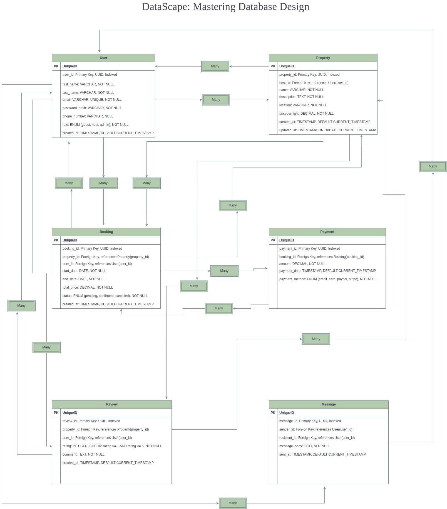

## **Entity–Relationship Diagram (ERD) Specification – AirBnB Clone**

### **Objective**

Design an Entity–Relationship Diagram (ERD) for the AirBnB database system based on the provided specification.
This ERD captures all entities, their attributes, and relationships.

---

### **1. Entities and Attributes**

#### **User**

| Attribute     | Type                                 | Description            |
| ------------- | ------------------------------------ | ---------------------- |
| user_id       | UUID, PK, Indexed                    | Unique user identifier |
| first_name    | VARCHAR, NOT NULL                    | User’s first name      |
| last_name     | VARCHAR, NOT NULL                    | User’s last name       |
| email         | VARCHAR, UNIQUE, NOT NULL            | User’s email address   |
| password_hash | VARCHAR, NOT NULL                    | Encrypted password     |
| phone_number  | VARCHAR, NULL                        | Optional phone number  |
| role          | ENUM(guest, host, admin), NOT NULL   | User role type         |
| created_at    | TIMESTAMP, DEFAULT CURRENT_TIMESTAMP | Account creation time  |

---

#### **Property**

| Attribute     | Type                                   | Description                 |
| ------------- | -------------------------------------- | --------------------------- |
| property_id   | UUID, PK, Indexed                      | Unique property identifier  |
| host_id       | FK → User(user_id)                     | Property owner              |
| name          | VARCHAR, NOT NULL                      | Property name               |
| description   | TEXT, NOT NULL                         | Description of the property |
| location      | VARCHAR, NOT NULL                      | Property location           |
| pricepernight | DECIMAL, NOT NULL                      | Nightly price               |
| created_at    | TIMESTAMP, DEFAULT CURRENT_TIMESTAMP   | Creation date               |
| updated_at    | TIMESTAMP, ON UPDATE CURRENT_TIMESTAMP | Last update date            |

---

#### **Booking**

| Attribute   | Type                                         | Description                |
| ----------- | -------------------------------------------- | -------------------------- |
| booking_id  | UUID, PK, Indexed                            | Unique booking identifier  |
| property_id | FK → Property(property_id)                   | Booked property            |
| user_id     | FK → User(user_id)                           | Guest who made the booking |
| start_date  | DATE, NOT NULL                               | Booking start date         |
| end_date    | DATE, NOT NULL                               | Booking end date           |
| total_price | DECIMAL, NOT NULL                            | Total booking cost         |
| status      | ENUM(pending, confirmed, canceled), NOT NULL | Booking status             |
| created_at  | TIMESTAMP, DEFAULT CURRENT_TIMESTAMP         | Creation time              |

---

#### **Payment**

| Attribute      | Type                                        | Description               |
| -------------- | ------------------------------------------- | ------------------------- |
| payment_id     | UUID, PK, Indexed                           | Unique payment identifier |
| booking_id     | FK → Booking(booking_id)                    | Related booking           |
| amount         | DECIMAL, NOT NULL                           | Payment amount            |
| payment_date   | TIMESTAMP, DEFAULT CURRENT_TIMESTAMP        | Date of payment           |
| payment_method | ENUM(credit_card, paypal, stripe), NOT NULL | Payment method            |

---

#### **Review**

| Attribute   | Type                                 | Description              |
| ----------- | ------------------------------------ | ------------------------ |
| review_id   | UUID, PK, Indexed                    | Unique review identifier |
| property_id | FK → Property(property_id)           | Reviewed property        |
| user_id     | FK → User(user_id)                   | Reviewer (guest)         |
| rating      | INTEGER (1–5), NOT NULL              | Rating score             |
| comment     | TEXT, NOT NULL                       | Review comment           |
| created_at  | TIMESTAMP, DEFAULT CURRENT_TIMESTAMP | Date of review           |

---

#### **Message**

| Attribute    | Type                                 | Description               |
| ------------ | ------------------------------------ | ------------------------- |
| message_id   | UUID, PK, Indexed                    | Unique message identifier |
| sender_id    | FK → User(user_id)                   | Sender                    |
| recipient_id | FK → User(user_id)                   | Receiver                  |
| message_body | TEXT, NOT NULL                       | Message content           |
| sent_at      | TIMESTAMP, DEFAULT CURRENT_TIMESTAMP | Time sent                 |

---

### **2. Relationships Between Entities**

| Relationship       | Description                                 | Type              |
| ------------------ | ------------------------------------------- | ----------------- |
| User → Property    | A host can have multiple properties         | 1 : M             |
| User → Booking     | A guest can make multiple bookings          | 1 : M             |
| Property → Booking | A property can be booked multiple times     | 1 : M             |
| Booking → Payment  | A booking can have one or multiple payments | 1 : M             |
| User → Review      | A user can post multiple reviews            | 1 : M             |
| Property → Review  | A property can have multiple reviews        | 1 : M             |
| User → Message     | A user can send/receive multiple messages   | 1 : M (dual role) |

---

### **3. ER Diagram**

```markdown

```
